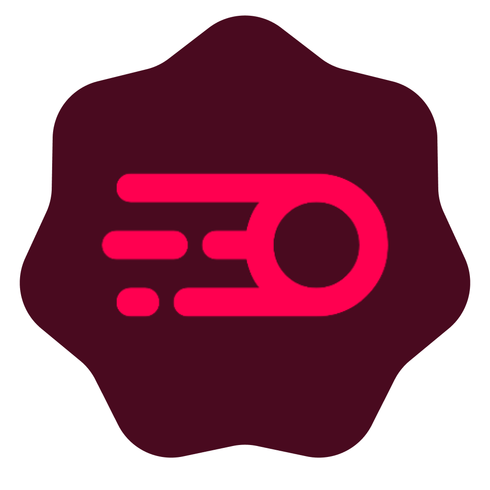
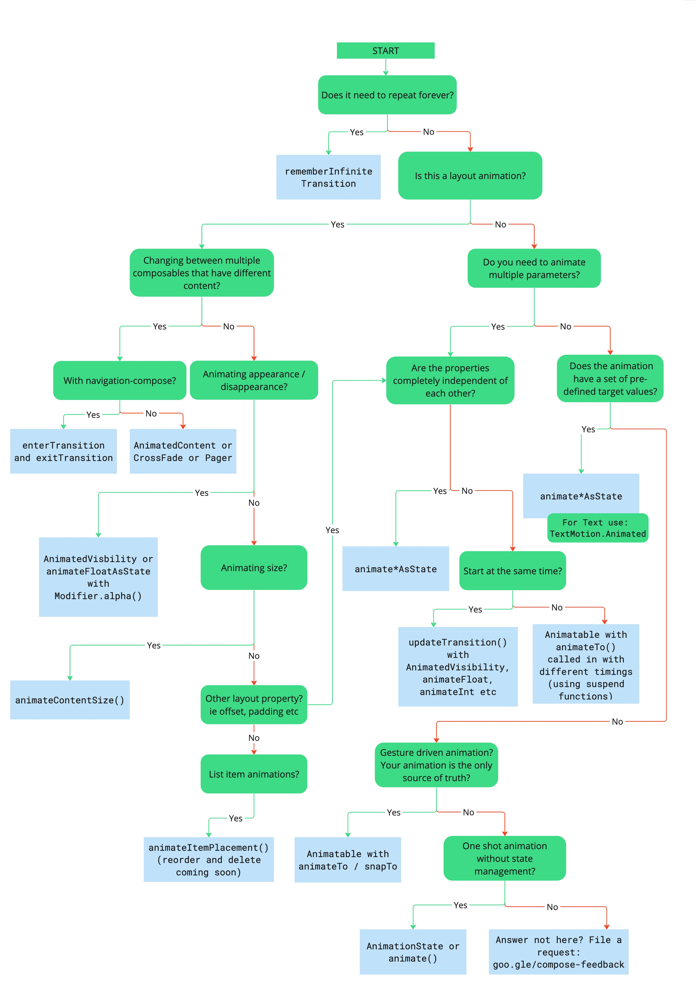

<div align="center">
</br>


</div>

<div align="center">

# Compose Animation Samples

</div>

</br>

<p align="center">
  </a>
  </a>
  </a> 
  </a>
</p>

<div align="center">

# 🗺️ Project Overview

Showcases animation API selection based on developer needs, this app is visualisation of this tree from official documentation

<a href="https://developer.android.com/develop/ui/compose/animation/choose-api">
  
</a>

# 📲 Download

Go to the [Releases](https://github.com/t8rin/ComposeAnimationSamples/releases/latest) and the download latest
apk

</div>

# 💻 Installation Instructions

1. Clone the repository:
   ```bash
   git clone https://github.com/yourusername/ComposeAnimationSamples.git
   ```
2. Install dependencies using your preferred package manager (e.g., Gradle).
3. Build the project:
   bash ./gradlew build
4. Run the application:
   bash ./gradlew run

<div align="center">

# ❤️ Find this repository useful?

Support it by joining **[stargazers](https://github.com/t8rin/ImageResizer/stargazers)** for this
repository. :star: <br>
And **[follow](https://github.com/t8rin)** me for my next creations! 🤩

</div>
